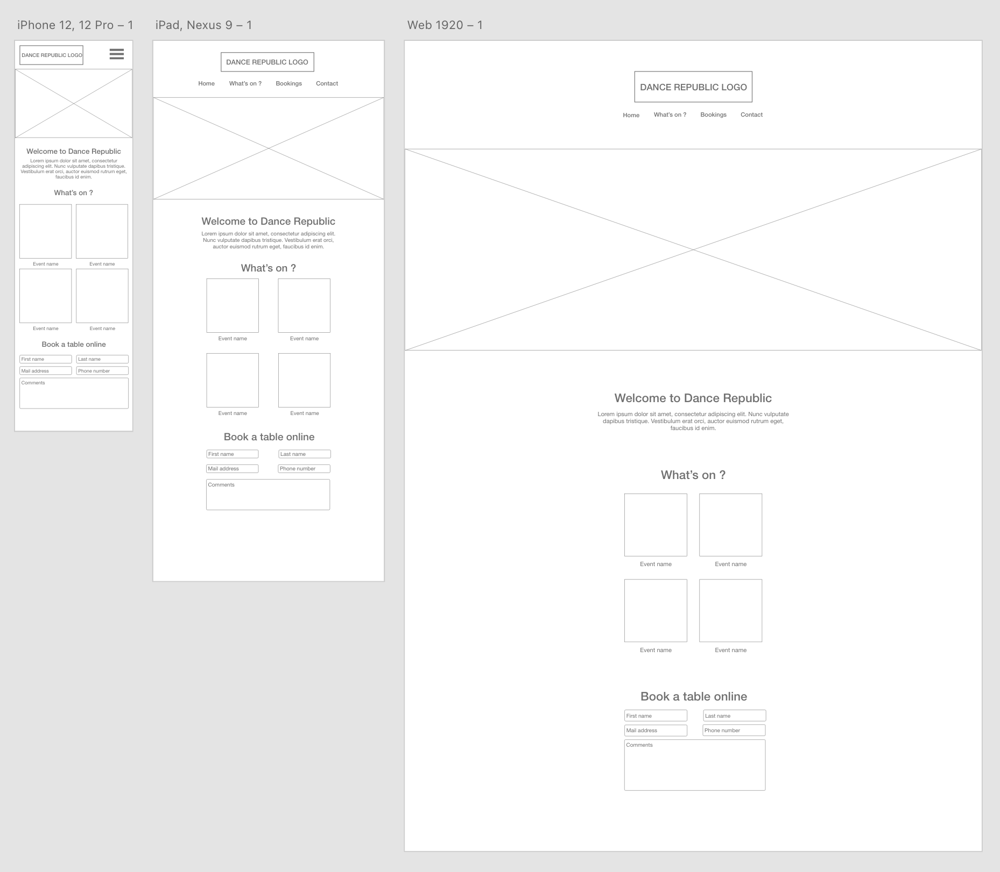

# Dance Republic Case Study

Dance Republic is a fictional nightclub, for which I created a fully custom WordPress website.

You can download all the files (Prototypes, code, etc) on my [Github repository](#).

This Case Study will be split into 3 sections :

1. Design
2. Theme Creation
3. Deployment

## Design

### Wireframes

The first step to designing a website is making wireframes. Wireframes are rough design prototypes, simply showing what shape and size each element will appear, as well as where on the page. I will be working on Adobe XD.

Even though I will make a wireframe for each type of screen, I always start with mobile sized screens. More than half of all website visits in 2020 were on mobile phones. Once this one is done, I simply extend the design and tweak it so it also works on bigger screens.

  

As you can see, wireframes are a very rough, and not very appealing first prototype. Usually at this stage, these would be delivered to the client so we can start working on revisions. For example they might want the banner to be smaller, the menu to not be centered, or fully re-arrange the content.

[Click here to download the Adobe XD file](Wireframes.xd)

### UI Design

Once the wireframes are approved by the client, we can move on to the actual UI design. We want to build on top of the wireframes and make the final design.
