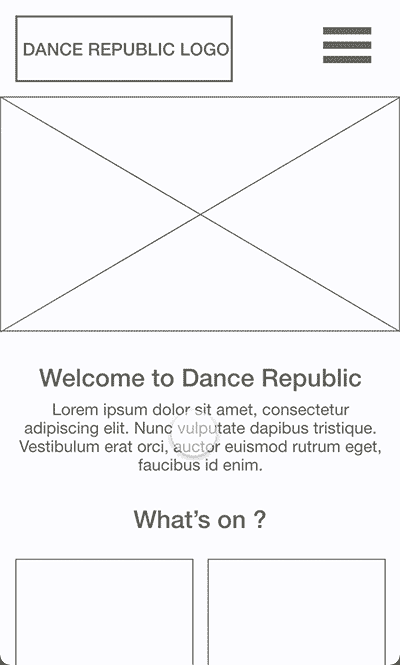
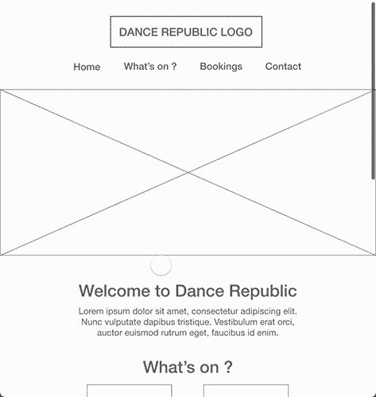
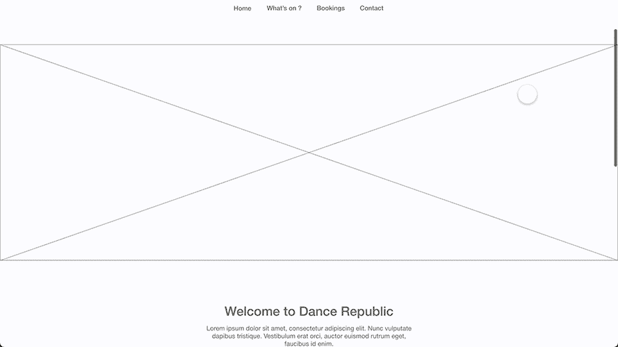

# Dance Republic Case Study

Dance Republic is a fictional nightclub, for which I created a fully custom WordPress website.

You can download all the files (Prototypes, code, etc) on my [Github repository](#).

This Case Study will be split into 3 sections :

1. Design
2. Theme Creation
3. Deployment

## Design

### Wireframes

The first step to designing a website is making wireframes. Wireframes are rough design prototypes, simply showing what shape and size each element will appear, as well as where on the page. I will be working on Adobe XD.

Making wireframes makes it easy to avoid design flaws (which would be time-consuming to fix) before we start making the final design.

In 2020, 61.8% of all website visits were on a smartphone. Smartphones are the most used device in a world, and by a large margin. As such, it is a very good idea to design and code websites with a mobile-first approach.

So, I started by designing a wireframe for smartphone users. The goal of the website is to : Communicate with the customers about the events coming up, and take online table bookings.

  

Next size up, I designed a wireframe for tablets. Most of the time, the design on tablets will be very close to what we get on computers.

  

And finally, I made a wireframe for computer users.

  

As you can see, wireframes are a very rough, and not very appealing first prototype. Usually at this stage, these would be delivered to the client so we can start working on revisions. For example they might want the banner to be smaller, the menu to not be centered, or fully re-arrange the content.

[Click here to download the Adobe XD file](Wireframes.xd)

### UI Design

Once the wireframes are approved by the client, we can move on to the actual UI design. We want to build on top of the wireframes and make the final design.
