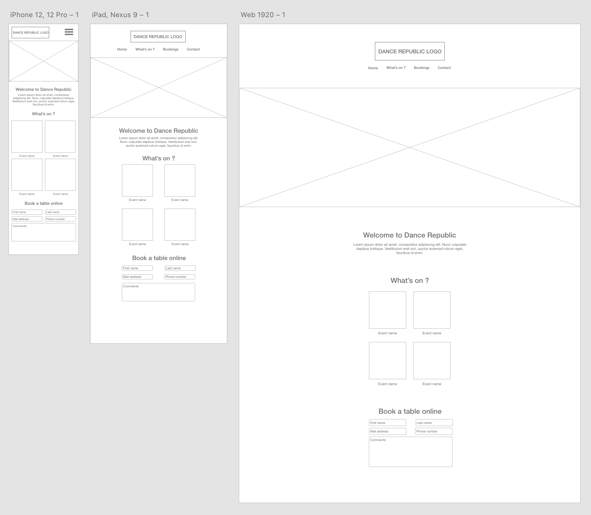

[Design](#design) [Development](#development) [Deployment](#deployment)

You can download all the files from this case study on this [Github repository](https://github.com/vcohere/vcohere.github.io).

1. Client's needs
2. Design
3. Development
4. Deployment

## Client's needs

The client is Dance Republic, an Australian nightclub. This company is completely fictional, and I came up with their needs just as an interesting exercise.

- Ability to take bookings online
- Display all the events coming up soon
- Being able to edit the events themselves in the back-end
- Contact form

## Design

### Wireframes

I always like to start with simple wireframing. Using Adobe XD I create the wireframes, link all the pages together, and send it to the client so they can start playing with a first "working" prototype.

The client can start sending me feedback and we can make modifications now, as they are easier to do on wireframes than on a full design.

I always like to start with the mobile screen first, and in general have a mobile-first approach.

  

[Click here to download the Adobe XD file](Wireframes.xd)

### UI Design

Once the client approves the wireframes, I can start designing. Usually at this stage, I already have an idea of how the website will look like. So I just have to get started in Adobe XD.

In this case, the website is for a nightclub so it will obviously be on a black background. For the accent colors, I chose #fff and #fff.

This was made in Adobe XD, some elements were modified in Photoshop first.

  

## Development

### Environment

Locally, I will be using [Local](https://localwp.com/) to run my WordPress, git to version my work and back it up to the cloud on a [Github repo](#), and [Atom](https://atom.io/).

### Theme

### Plugins

## Deployment
